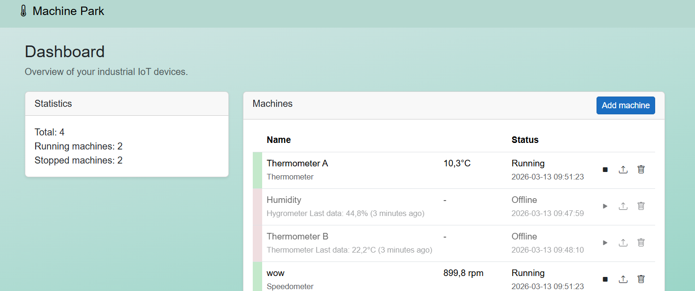
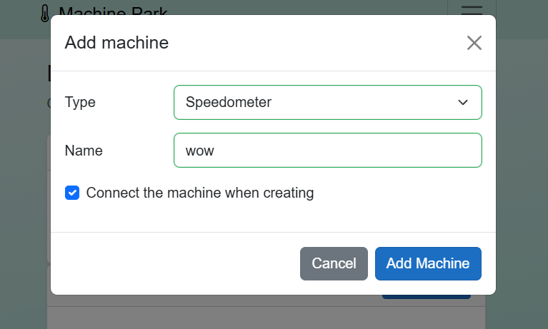
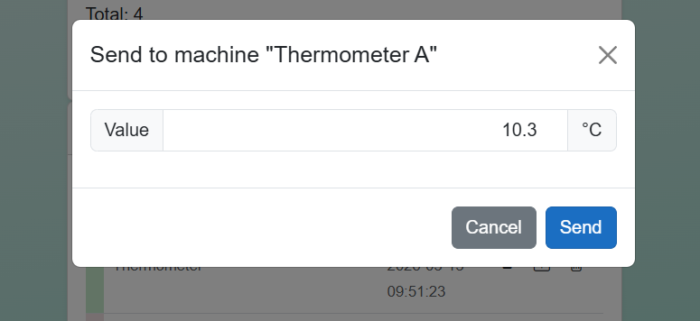

# MachinePark

MachinePark is a small **Blazor Web App** for managing a park of machines.  
The application provides a dashboard where machines can be monitored and controlled in real time.

The project was built as a **.NET learning project** and demonstrates a simple full-stack architecture using **Blazor, Web API, and SignalR**.

# Features

The application supports the following functionality:

### Machine Management

- View all machines
- Start a machine
- Stop a machine
- Update machine data
- Add a new machine
- Remove a machine

### Dashboard

The dashboard provides an overview of the machine park:

- Total number of machines
- Number of running machines
- Number of stopped machines
- Current machine status

### Real-Time Updates

The application uses **SignalR** to push updates from the server to the UI in real time.  
This ensures that machine status and data changes are immediately reflected in the dashboard without requiring manual refresh.


# Tech Stack

- **.NET 10**
- **Blazor Web App**
- **ASP.NET Core Web API**
- **SignalR**
- **Bootstrap 5**

# Project Structure

The solution is divided into three projects:

```
MachinePark
│
├── MachinePark # Server (API, business logic, SignalR hub)
├── MachinePark.Client # Blazor WebAssembly frontend
└── MachinePark.Shared # Shared models used by both client and server
```

The **Shared** project contains data models used by both the client and the server to avoid duplication and keep the API contract consistent.

This structure separates concerns while keeping the solution easy to understand for a learning project.


# Application UI

The application consists of a single **Dashboard view** that displays and manages the entire machine park.

From the dashboard the user can handle all machine management tasks, including starting/stopping machines, updating data, and adding/removing machines.

All forms are opened using **Bootstrap modals**, allowing the user to perform actions without leaving the dashboard.

### Error Handling

The application includes basic error handling to manage cases where the server becomes unavailable.

# API

The backend exposes a simple API for managing machines.

| Method | Description |
|------|-------------|
| `GetMachines()` | Returns all machines |
| `AddMachine()` | Adds a new machine |
| `RemoveMachine()` | Removes a machine |
| `StartMachine()` | Starts a machine |
| `StopMachine()` | Stops a machine |
| `UpdateMachineData()` | Updates machine data |

# Data Storage

For simplicity, the application currently uses an **in-memory list** to store machines.

This means:

- No database setup is required
- Data is reset when the application restarts

# Example Machine Model

```csharp
public class Machine
{
    public int Id { get; set; }
    public string Name { get; set; }
    public MachineType Type { get; set; }

    public bool IsOnline { get; set; }

    public double LastData { get; set; }
    public DateTime LastUpdated { get; set; }
}
```

# Screenshots

## Dashboard

The dashboard displays all machines in the system along with their status and available actions.



## Add Machine

Machines can be added directly from the dashboard using a modal form.



## Update Machine Data

Machine data can be updated without leaving the dashboard.

